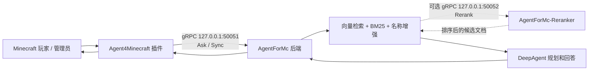

# AgentForMc-Reranker

AgentForMc-Reranker 是 AgentForMc 体系里的可选 reranker 中间件。它把 BCE reranker 模型从主后端 `F:\AgentForMc` 中拆出来，单独作为 gRPC 服务运行。

启用后，主后端仍然负责 Minecraft 问答、RAG 检索、DeepAgent 规划、配置同步和答案生成；本服务只负责对后端传来的候选文档做重排。未启动本服务时，后端会自动降级为原来的 BM25/vector 融合结果，不影响 `/askmc` 基础问答链路。

## 三个仓库的关系

| 仓库 | 本地路径 | 职责 |
| --- | --- | --- |
| Agent4Minecraft | `F:\Agent4Minecraft` | Minecraft 插件端，提供 `/askmc`、`/a4m sync`、`/a4m status`，负责游戏内入口、配置扫描、脱敏和 gRPC 上传 |
| AgentForMc | `F:\AgentForMc` | AI 后端，负责 gRPC bridge、DeepAgent、RAG、配置语义记忆、答案生成和同步状态 |
| AgentForMc-Reranker | `F:\AgentForMc-Reranker` | 可选重排中间件，独立加载 BCE reranker 模型并通过 gRPC 给后端返回排序结果 |

整体调用链：



## 什么时候需要运行它

不需要 reranker 时，只运行：

```text
Agent4Minecraft 插件 -> AgentForMc 后端
```

需要更高质量的候选文档排序时，再额外运行：

```text
Agent4Minecraft 插件 -> AgentForMc 后端 -> AgentForMc-Reranker 中间件
```

本服务会增加额外模型加载、内存占用和推理耗时。建议先确认基础问答和配置同步可用，再开启 reranker。

## 功能特性

- 独立 gRPC 服务，默认监听 `127.0.0.1:50052`
- 使用 `BCEmbedding.RerankerModel.compute_score`
- `Rerank` RPC 使用 Bearer token 鉴权
- `Health` RPC 用于本地健康检查
- 默认模型：`maidalun1020/bce-reranker-base_v1`
- 排序规则：score 降序，分数相同时保持原始输入顺序
- 后端调用失败时可安全降级，不拖垮 Minecraft 问答请求

## 环境要求

- Python 3.10+，推荐 Python 3.11
- 可安装 `requirements.txt` 中的 Python 依赖
- 首次运行时需要能下载或访问 BCE reranker 模型
- 足够的内存用于加载 reranker 模型

核心依赖：

- `BCEmbedding`
- `grpcio`
- `grpcio-tools`
- `protobuf`
- `tomli`
- `pytest`

## 快速开始

### 1. 安装依赖

在本仓库中执行：

```powershell
cd F:\AgentForMc-Reranker
py -m venv .venv
.\.venv\Scripts\python.exe -m pip install --upgrade pip
.\.venv\Scripts\python.exe -m pip install -r requirements.txt
```

如果你已经确认另一个虚拟环境包含本项目依赖，也可以用那个解释器运行本服务。

### 2. 配置 token

复制环境变量模板：

```powershell
Copy-Item .env.example .env
```

编辑 `.env`：

```dotenv
RAG_RERANKER_GRPC_AUTH_TOKEN="change_me_to_a_strong_token"
```

这个 token 必须和 `F:\AgentForMc` 后端进程里的 `RAG_RERANKER_GRPC_AUTH_TOKEN` 完全一致。它不是 Minecraft 插件的 `backend.authToken`，不要和 `RAG_GRPC_AUTH_TOKEN` 混用。

### 3. 自检

```powershell
.\.venv\Scripts\python.exe main.py --self-check
```

预期输出类似：

```text
reranker self-check ok: 127.0.0.1:50052 model=maidalun1020/bce-reranker-base_v1
```

### 4. 启动 reranker 中间件

```powershell
.\.venv\Scripts\python.exe main.py
```

默认监听：

```text
127.0.0.1:50052
```

## 接入 AgentForMc 后端

在 `F:\AgentForMc\.env` 中加入和本服务一致的 token：

```dotenv
RAG_RERANKER_GRPC_AUTH_TOKEN="change_me_to_a_strong_token"
```

在 `F:\AgentForMc\config.toml` 中开启 reranker：

```toml
[reranker]
enabled = true
host = "127.0.0.1"
port = 50052
timeout_seconds = 10
```

然后按顺序启动：

1. 启动 `AgentForMc-Reranker`
2. 启动 `AgentForMc`
3. 启动 Paper / Spigot 服务端，让 `Agent4Minecraft` 插件连接后端

后端到 reranker 的连接失败时，后端会记录失败并继续使用 BM25/vector 融合结果。

## 接入 Agent4Minecraft 插件

插件端不需要知道 reranker 的存在，也不需要改 proto 或命令。

插件仍然只连接 `AgentForMc`：

```yaml
backend:
  authToken: "change_me_to_a_strong_token"
  host: "127.0.0.1"
  port: 50051
```

这里的 `backend.authToken` 必须匹配 `F:\AgentForMc\.env` 里的：

```dotenv
RAG_GRPC_AUTH_TOKEN="change_me_to_a_strong_token"
```

注意两类 token 的区别：

| Token | 用途 | 配置位置 |
| --- | --- | --- |
| `RAG_GRPC_AUTH_TOKEN` | Agent4Minecraft 插件调用 AgentForMc 后端 | `F:\AgentForMc\.env` 和插件 `backend.authToken` |
| `RAG_RERANKER_GRPC_AUTH_TOKEN` | AgentForMc 后端调用 AgentForMc-Reranker | `F:\AgentForMc\.env` 和 `F:\AgentForMc-Reranker\.env` |

## 推荐本地联调顺序

1. 在 `F:\AgentForMc-Reranker` 启动 reranker：

```powershell
.\.venv\Scripts\python.exe main.py
```

2. 在 `F:\AgentForMc` 启动后端：

```powershell
.\.venv\Scripts\python.exe main.py
```

3. 启动 Minecraft Paper / Spigot 服务端。

4. 在游戏内执行：

```text
/a4m sync
/a4m status
/askmc eco 插件的金币倍率在哪里配置？
```

## 配置说明

本服务配置由两部分组成：

- `.env`：只放密钥和敏感值
- `config.toml`：放非敏感运行时配置

默认 `config.toml`：

```toml
[reranker]
model_name_or_path = "maidalun1020/bce-reranker-base_v1"

[grpc]
host = "127.0.0.1"
port = 50052
max_workers = 2

[runtime]
request_timeout_seconds = 60

[paths]
model_cache_dir = ".cache/models"
```

可用环境变量：

| 变量 | 必需 | 说明 |
| --- | --- | --- |
| `RAG_RERANKER_GRPC_AUTH_TOKEN` | 是 | 后端调用 reranker 的 Bearer token |
| `RAG_RERANKER_ENV_FILE` | 否 | 覆盖默认 `.env` 路径 |
| `RAG_RERANKER_CONFIG_TOML` | 否 | 覆盖默认 `config.toml` 路径 |

## gRPC 合约

协议文件：

```text
agent_for_mc_reranker/interfaces/grpc/reranker.proto
```

后端镜像协议文件：

```text
F:\AgentForMc\agent_for_mc\interfaces\grpc\reranker.proto
```

服务：

```proto
service RerankerService {
  rpc Health(HealthRequest) returns (HealthResponse);
  rpc Rerank(RerankRequest) returns (RerankResponse);
}
```

`RerankRequest` 主要字段：

| 字段 | 说明 |
| --- | --- |
| `request_id` | 后端生成的请求 ID |
| `query` | 当前检索查询 |
| `documents[].index` | 文档在候选列表中的原始位置 |
| `documents[].document_id` | 后端文档 ID |
| `documents[].text` | 用于 rerank 的文本 |
| `top_k` | 可选，仅返回前 N 个结果 |

`RerankResponse` 返回：

| 字段 | 说明 |
| --- | --- |
| `results[].index` | 原始候选文档位置 |
| `results[].document_id` | 后端文档 ID |
| `results[].score` | reranker 分数 |

改动 proto 时必须同步更新：

- 本仓库 `reranker.proto`
- 本仓库生成的 `reranker_pb2.py` 和 `reranker_pb2_grpc.py`
- 后端仓库 `F:\AgentForMc\agent_for_mc\interfaces\grpc\reranker.proto`
- 后端仓库生成的 `reranker_pb2.py` 和 `reranker_pb2_grpc.py`
- 两边相关测试

## 项目结构

```text
F:\AgentForMc-Reranker
├─ main.py
├─ config.toml
├─ requirements.txt
├─ agent_for_mc_reranker
│  ├─ config.py
│  ├─ model.py
│  ├─ server.py
│  ├─ service.py
│  └─ interfaces\grpc
│     ├─ reranker.proto
│     ├─ reranker_pb2.py
│     └─ reranker_pb2_grpc.py
└─ tests
   ├─ test_config.py
   └─ test_service.py
```

## 开发和测试

运行测试：

```powershell
.\.venv\Scripts\python.exe -m pytest
```

如果本仓库 `.venv` 尚未安装依赖，但 `F:\AgentForMc\.venv` 已经安装了测试依赖，可以临时使用：

```powershell
F:\AgentForMc\.venv\Scripts\python.exe -m pytest
```

重新生成 gRPC 代码：

```powershell
cd F:\AgentForMc-Reranker\agent_for_mc_reranker\interfaces\grpc
F:\AgentForMc-Reranker\.venv\Scripts\python.exe -m grpc_tools.protoc -I. --python_out=. --grpc_python_out=. reranker.proto
```

生成后检查 `reranker_pb2_grpc.py` 的导入应为包内相对导入：

```python
from . import reranker_pb2 as reranker__pb2
```

## 常见问题

### 后端开启 reranker 后仍然能回答，但日志里有 reranker gRPC failed

这是预期降级行为。检查：

- `AgentForMc-Reranker` 是否已启动
- 后端 `[reranker].host` 和 `port` 是否正确
- 两边 `RAG_RERANKER_GRPC_AUTH_TOKEN` 是否一致
- 防火墙是否允许后端访问 `50052`

### 后端启动时报 Missing reranker auth token

后端启用了：

```toml
[reranker]
enabled = true
```

但 `F:\AgentForMc\.env` 里没有设置：

```dotenv
RAG_RERANKER_GRPC_AUTH_TOKEN="..."
```

### Reranker 自检失败

先确认 `.env` 存在并包含 token，再确认依赖已安装：

```powershell
.\.venv\Scripts\python.exe -m pip install -r requirements.txt
.\.venv\Scripts\python.exe main.py --self-check
```

### 首次启动很慢

首次启动可能需要下载或初始化 BCE reranker 模型。模型缓存默认放在：

```text
.cache/models
```

### 插件端需要修改吗

不需要。Agent4Minecraft 只和 AgentForMc 后端通信。reranker 是后端的可选下游服务。

## 生产部署建议

- 不要使用示例 token。
- `RAG_GRPC_AUTH_TOKEN` 和 `RAG_RERANKER_GRPC_AUTH_TOKEN` 分开管理。
- 如果 reranker 和后端跨机器部署，限制 `50052` 的来源 IP。
- 公网部署时建议放在受控内网或网关后面。
- 不要提交 `.env`、`.cache/`、`.venv/`、模型缓存或运行时数据。
- 先在测试服完成 `/a4m sync` 和 `/askmc` 验证，再切到正式服。

## 当前状态

截至 `2026-04-28`：

- standalone reranker gRPC 服务已实现
- 后端 `F:\AgentForMc` 已支持远程 reranker 客户端和失败降级
- 插件端 `F:\Agent4Minecraft` 无需改动
- 自动化测试已覆盖配置加载、鉴权、空请求、稳定排序和后端客户端排序映射

## License

当前仓库尚未包含显式开源许可证文件。公开发布前建议补充 `LICENSE`，并与 AgentForMc / Agent4Minecraft 保持一致。
